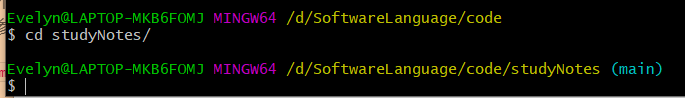
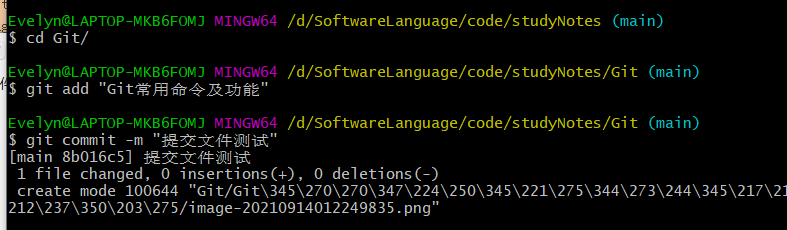
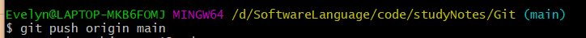

# Git常用的命令和功能

## 1、Github文件拷贝到本地

在接触Git之前就知道了Github，所以最先都是在Github中创建文件夹和文件，那么如何将Github上的文件拷贝到本地呢？

```
$ git clone git@github.com:Evelynww/studyNotes.git
```

其中`$ git clone git@github.com:`是固定部分，`Evelynww/ `是你的Github的账号名`studyNotes.git` 是你这个库的名字。

## 2、本地的修改如何传到Github上？

### step1:进入目录

我们首先要进入到我们的库目录下



然后使用`cd` 命令进入我们要提交的文件的上一级目录

### Step2:git add、git commit -m

接着使用`git add 文件名`添加我们修改的文件，告诉Git将文件提交到仓库。

接着使用`git commit -m 描述信息`告诉Git将文件提交到仓库。其中-m后面是本次提交的描述信息。

### step 3:git push 分支

最后使用`git push` 命令将当前分支推送到远程。



### 注意事项

去Github上看发现并没有把我们正在写的这个md文件传上去，而是把md关联的图片文件夹传上去了。所以我们**在上传文件的时候一定要记得把文件扩展名加上**。

